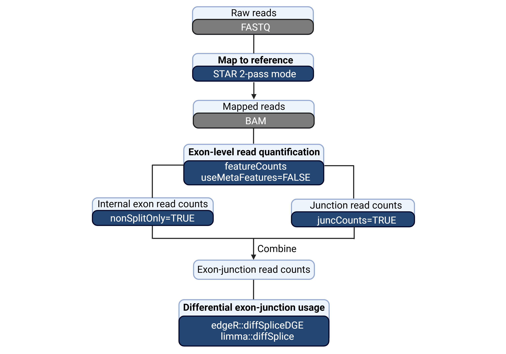

# Differential Exon-Junction Usage (DEJU)

This is the repository for the code used to perform analysis and generate figures for the following paper titled "Incorporating exon-exon junction reads enhances differential splicing detection". 

### Introduction

The paper introduced a DEJU analysis workflow implementing a STAR-Rsubread-edgeR-limma framework to identify DEU genes indicative of differential splicing between experimental conditions in RNA-seq data. Here is a schematic presentation of our proposed DEJU workflow.



The paper also benchmarked the DEJU analysis methods implemented in edgeR and limma (DEJU-edgeR, DEJU-limma) against the existing DEU analysis methods (DEU-edgeR, DEU-limma) and other popular R-based DEU/DEJU tools (DEXSeq, JunctionSeq) based on simulated RNA-seq datasets. We also performed DEU analysis on RNA-sequencing experiments of [NCBI GEO database (GSE227748)](https://www.ncbi.nlm.nih.gov/geo/query/acc.cgi?acc=GSE227748) using our proposed method and other DEU analysis pipelines benchmarked in the study.

### Results and conclusion

By incorporating exon-exon junction reads, our DEJU methods demonstrates higher performance over other benchmarked methods in FDR control, statistical power, computational efficiency (turnaround time + memory usage), and flexibility in detecting a broad range of AS events, notably alternative splice sites and intron retention, making it the most suitable candidate for DEJU analysis in RNA-seq data.
In practical applications, our DEJU method effectively handles splicing alterations involving multiple known and novel transcripts, while supporting complex experimental designs. However, it is not recommended for non-model organisms with the incomplete reference genome and does not provide transcript-level abundance estimates.

### Citation

If you are using code or pipelines from this repository, please consider citing our associated article:

Pham, M. T., Milevskiy, M. J. G., Visvader, J. E., Chen, Y. Incorporating exon-exon junction reads enhances differential splicing detection. ...

### Repository Structure

```plaintext
DEJU/
├── annotation/
│   ├── gene_info_GRCm39_M32_ensembl109.tsv    # Gene information
│   └── duplicated_sequences.tsv    # duplicate sequences that should be ignored for the simulation process
├── code/
│   ├── annotation_dl    # Script to prepare reference genome datasets of mm39 (GTF, FASTA, exon-junction SAF...) 
│   ├── alignment      # Script to map reads to reference genome mm39
│   ├── DEU            # Script to quantify exon-junction counts and detect DEU genes by 6 benchmarked methods
│   ├── simulation    # Main script to generate customized transcriptome, generate and analyze simulation data
│   ├── fastq_dl      # Script to download FASTQ files with GEO acession number
│   ├── case_study    # Main script to analyze case-study data
│   └── analysis      # Main script to perform overall analysis, create figures for the paper
├── tools/
│   └── Subread_to_DEXSeq/    # External scripts to generate exon counts for DEXSeq
├── figures/
│   └── fig_S1.png    # DEJU analysis worflow
└── README.md                  # Main documentation for the repository
```

### DEJU workflow

1. Exon-junction read mapping (STAR splice-aware aligners)

Input files:
Output files:

2. Exon-junction read quantification (Rsubread featureCounts)

Input files:

```r
count <- Rsubread::featureCounts(BAM_files, # input BAM files from STAR aligner
                                  annot.ext=flat_exon.tsv, # merged and flattened exon annotation
                                  useMetaFeatures=FALSE, # summarize exon-level reads
                                  nonSplitOnly=TRUE, splitOnly=FALSE, # quantify internal exon reads
                                  juncCounts=TRUE # quantify exon-exon junction reads)
```

Output files:

Internal exon counts are stored in `count$counts` object

Exon-exon junction counts are stored in `count$counts_junction object

Final count matrix (internal exon + junction counts) will be stored in `final_count` object

3. Differential exon-junction usage (edgeR diffSpliceDGE)

   - Input files: `final_count` (exon-junction counts), `annot` (exon-junction annotation), `group` (group details), `contr` (contrast matrix), `design` (design matrix)

```r
message("Constructing DGElist object ...")  
y <- DGEList(counts=final_count, genes=annot, group=group)
colnames(y) <- gsub("[.].*$", "", colnames(y))

message("Filtering exons with low mapping reads ...")
keep <- filterByExpr(y, group=group)
y <- y[keep, , keep.lib.sizes=FALSE]

message("Normalizing lib sizes ...")
y <- normLibSizes(y)

message("Estimating dispersion ...")
y <- estimateDisp(y, design, robust=TRUE)

message("Fitting GLM-QL model for design matrix ...")
fit <- glmQLFit(y, design, robust=TRUE)

message("Running diffSpliceDGE ..")
sp <- diffSpliceDGE(fit, contrast=contr, geneid="GeneID", exonid="Start")
DEU_simes <- topSpliceDGE(sp, test="Simes", number=Inf)
DEU_F <- topSpliceDGE(sp, test="gene", number=Inf)
DEU_exon <- topSpliceDGE(sp, test="exon", number=Inf)
```

Output files:
Results provides ranked genes or exons by evidence for differential splicing, based on sorted adjusted p-values. 
The exon-level tests test for differences between each exon and all the exons for the same gene. 
The gene-level tests test for any differences in exon usage between experimental conditions. 
The Simes method processes the exon-level p-values to give an overall call of differential splicing for each gene. 
It returns the minimum Simes-adjusted p-values for each gene. 
The gene-level tests are likely to be powerful for genes in which several exons are differentially splices. 
The Simes p-values is likely to be more powerful when only a minority of the exons for a gene are differentially spliced. 

**DEU genes from gene-level Simes test**

|GeneID|Chr|Strand|Symbol|NExons|P.Value|FDR|
|----|----|----|----|----|----|----|
|ENSMUSG00000028337.15|chr4|-|Coro2a|27|5.63409202936316e-18|7.44150875238286e-14|
|ENSMUSG00000052033.14|chr2|+|Pfdn4|11|7.025331391432e-17|4.63952885090169e-13|
|ENSMUSG00000031075.20|chr7|-|Ano1|62|1.87426860695308e-12|8.25177992021212e-09|
|ENSMUSG00000022106.15|chr14|+|Rcbtb2|34|3.01085278939628e-12|9.9418359105865e-09|

**Field descriptions:**

`GeneID`, `Chr`, `Strand`, `Symbol`: Gene details\
`NExons`: The total number of exons and junctions of the gene\
`P.value`: p-value of Simes test\
`FDR`: False discovery rate

**DEU genes from gene-level F-test**

|GeneID|Chr|Strand|Symbol|NExons|gene.F|P.Value|FDR|
|----|----|----|----|----|----|----|----|
|ENSMUSG00000035202.9|chr9|+|Lars2|35|16.1933702582295|1.11593822152576e-34|1.47393120299123e-30|
|ENSMUSG00000028337.15|chr4|-|Coro2a|27|12.5816242961678|7.64969721594055e-23|5.05186004140714e-19|
|ENSMUSG00000022091.7|chr14|-|Sorbs3|38|7.89331056107204|4.92908588386424e-21|2.17011221180263e-17|
|ENSMUSG00000021224.16|chr12|-|Numb|28|10.4648157641059|1.90223935574928e-20|6.28119435268413e-17|

**Field descriptions:**

`GeneID`, `Chr`, `Strand`, `Symbol`: Gene details\
`NExons`: The total number of exons and junctions of the gene\
`gene.F`: F-statistics for gene\
`P.value`: p-value of F-test\
`FDR`: False discovery rate

**Differentially used exons and splice junctions from exon-level test**

|GeneID|Chr|Start|End|Strand|Length|Region|annotated|Symbol|logFC|exon.F|P.Value|FDR|
|----|----|----|----|----|----|----|----|----|----|----|----|----|
|ENSMUSG00000028337.15|chr4|46576626|46581702|-|1|Junction|0|Coro2a|2.23199936023307|118.83727786305|2.08670075161598e-19|4.90410150542534e-14|
|ENSMUSG00000028337.15|chr4|46576626|46583643|-|1|Junction|0|Coro2a|2.19408998911786|114.148756203849|6.73068952852665e-19|7.90913230462874e-14|
|ENSMUSG00000052033.14|chr2|170338348|170338519|+|172|Exon|1|Pfdn4|2.72395320118021|173.077184263658|6.38666490130182e-18|5.00324941703083e-13|
|ENSMUSG00000031075.20|chr7|144292097|144292329|-|233|Exon|1|Ano1|-2.4622662045429|64.9322523521431|3.0230138821824e-14|1.77614913387215e-09|

-**Field descriptions:**

`GeneID`, `Chr`, `Strand`, `Symbol`: Gene details\
`Start`, `End`: Start/end coordinators of exonic/junction regions\
`Region`: Whether the region is junction or exon\
`annotated`: whether exon/junction is annotated or novel\
`logFC`: log2 fold-change of one exon vs all the exons for the same gene\
`exon.F`: F-statistics for exon/junction\
`P.value`: p-value of exon-level test\
`FDR`: False discovery rate\
